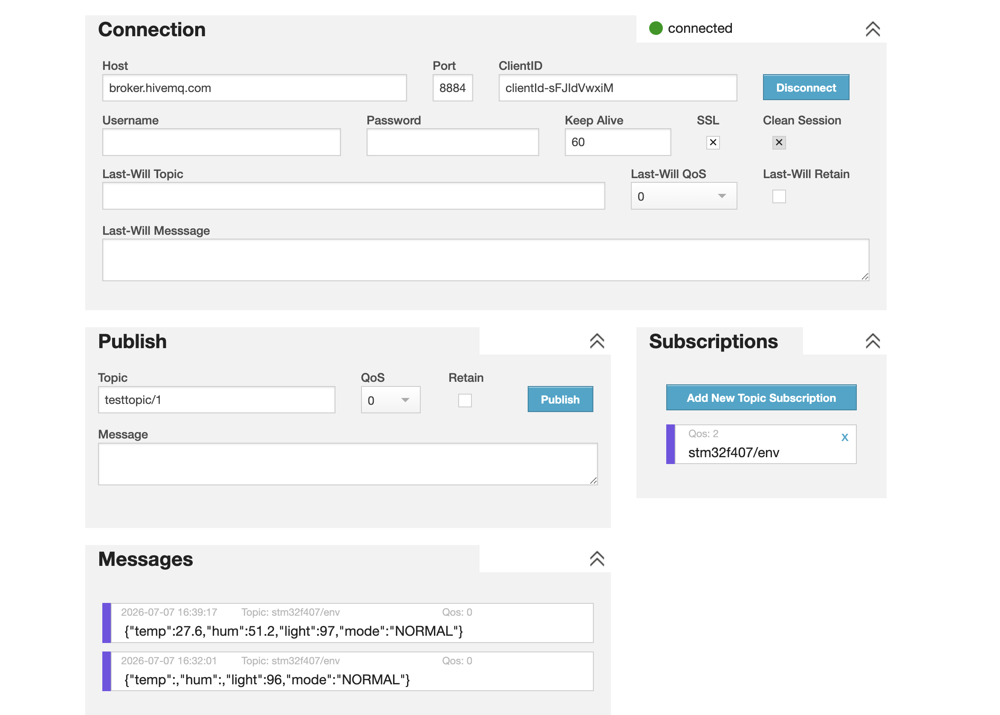
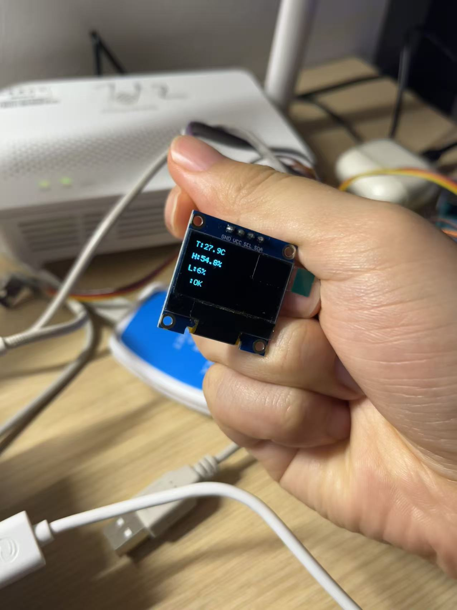
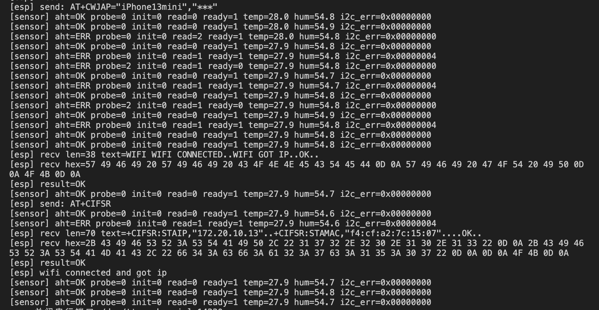
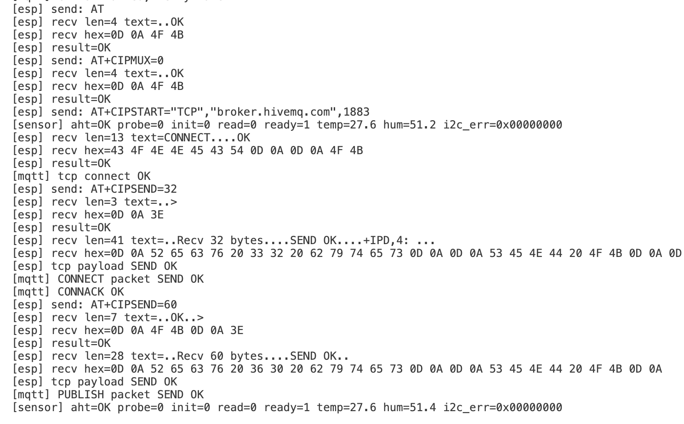
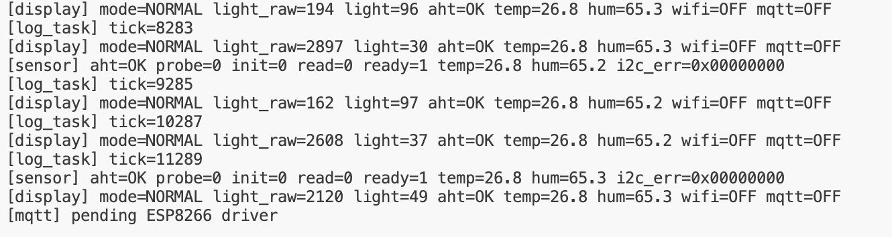

# STM32F407 AIoT 桌面环境助手

基于 STM32F407ZGT6 + FreeRTOS 的桌面 AIoT 环境监测助手。项目围绕本地环境采集、OLED 显示、按键交互、串口日志、ESP01S WiFi 入网和 MQTT 环境数据上报展开，目标是形成一个可展示、可复现、可写入简历的嵌入式项目。

当前版本已完成本地 MVP、ESP01S WiFi 基础入网链路和 MQTT 最小发布验证：

- AHT30 温湿度采集。
- 板载光敏传感器 `PF7 / ADC3_IN5` 真实采样。
- OLED 显示温度、湿度、光照百分比和 WiFi 状态。
- KEY0 / KEY1 / KEY2 本地交互。
- USART1 串口日志。
- ESP01S 通过 USART3 完成 `AT / ATE0 / CWMODE / CWJAP / CIFSR` 入网流程。
- ESP01S 通过 TCP 连接 MQTT broker，完成 MQTT CONNECT / CONNACK，并向 topic 发布环境数据。

## 项目效果

MQTT 平台端接收结果：



OLED 本地显示：



ESP01S WiFi 入网日志：



MQTT 最小发布成功日志：



板载光敏传感器验证：



## 硬件组成

| 模块 | 连接 / 说明 |
| --- | --- |
| 主控 | 正点原子探索者 STM32F407ZGT6 |
| RTOS | FreeRTOS / CMSIS-RTOS V2 |
| 温湿度 | AHT30，I2C1，地址 `0x38` |
| OLED | SSD1306 128x64 I2C，I2C1，地址 `0x3C` |
| 光敏 | 板载 LS1 / LIGHT_SENSOR，`PF7 / ADC3_IN5` |
| WiFi | ESP01S / ESP8266 AT 固件，`USART3 PB10/PB11` |
| 日志串口 | USART1 |
| 按键 | KEY0 模式切换，KEY1 状态打印/I2C 扫描，KEY2 清除报警 |

I2C1 当前共用连接：

```text
PB6 / I2C1_SCL -> AHT30 SCL + OLED SCL
PB7 / I2C1_SDA -> AHT30 SDA + OLED SDA
3.3V            -> AHT30 VCC + OLED VCC
GND             -> AHT30 GND + OLED GND
```

ESP01S 当前连接：

```text
PB10 / USART3_TX -> ESP01S RXD
PB11 / USART3_RX -> ESP01S TXD
GND              -> ESP01S GND
3.3V             -> ESP01S VCC / EN
```

## 已实现功能

### FreeRTOS 多任务框架

工程已拆出应用层模块，避免把业务逻辑堆在 `main.c`：

```text
App/app_main.c      应用入口
App/app_state.c     统一系统状态
App/app_sensor.c    AHT30 + 光敏采集
App/app_display.c   OLED 显示
App/app_wifi.c      ESP01S AT / WiFi 入网
App/app_mqtt.c      MQTT CONNECT / PUBLISH 最小发布验证
```

当前主要任务包括：

- `sensorTask`：周期采集 AHT30 和光敏 ADC。
- `displayTask`：刷新 OLED 状态页面。
- `keyTask`：处理 KEY0 / KEY1 / KEY2。
- `wifiTask`：执行 ESP01S AT 入网流程。
- `mqttTask`：在 WiFi 成功后执行 MQTT TCP 连接、CONNECT 握手和一次环境数据发布。

### 本地环境采集

AHT30 温湿度通过 I2C1 读取，光敏传感器使用板载 `PF7 / ADC3_IN5` 真实采样。

验证现象：

```text
[display] mode=NORMAL light_raw=194  light=96 aht=OK temp=26.8 hum=65.3 wifi=OFF mqtt=OFF
[display] mode=NORMAL light_raw=2897 light=30 aht=OK temp=26.8 hum=65.3 wifi=OFF mqtt=OFF
```

### OLED 状态显示

OLED 显示内容来自统一的 `AppState_t`，当前包括：

```text
T: 温度
H: 湿度
L: 光照百分比
W: WiFi 状态
```

WiFi 短状态映射：

```text
APP_WIFI_OFF        -> W:OFF
APP_WIFI_CONNECTING -> W:CONN
APP_WIFI_CONNECTED  -> W:OK
APP_WIFI_ERROR      -> W:ERR
```

### 按键交互

| 按键 | 功能 |
| --- | --- |
| KEY0 | 切换 `NORMAL / FOCUS / ALERT` 模式 |
| KEY1 | 打印系统状态，并触发 I2C 扫描 |
| KEY2 | 清除报警状态，必要时回到 `NORMAL` |

I2C 扫描验证：

```text
[i2c] found device: 0x38
[i2c] found device: 0x3C
[i2c] scan done, found=2
```

### ESP01S WiFi 入网

ESP01S 使用 USART3 进行 AT 指令通信。当前已验证链路：

```text
AT
ATE0
AT+CWMODE_CUR=1
AT+CWJAP="YOUR_WIFI_SSID","YOUR_WIFI_PASSWORD"
AT+CIFSR
```

验证结果：

```text
WIFI CONNECTED
WIFI GOT IP
OK
[esp] wifi connected and got ip
```

### MQTT 最小发布验证

当前已完成 MQTT 3.1.1 CONNECT / CONNACK / PUBLISH 最小闭环，验证链路：

```text
WiFi CONNECTED / WIFI GOT IP
AT+CIPMUX=0
AT+CIPSTART="TCP","broker.hivemq.com",1883
AT+CIPSEND=32
MQTT CONNECT packet
+IPD,4: 20 02 00 00
AT+CIPSEND=60
MQTT PUBLISH packet
```

验证结果：

```text
[mqtt] tcp connect OK
[esp] tcp payload SEND OK
[mqtt] CONNECT packet SEND OK
[mqtt] CONNACK OK
[mqtt] PUBLISH packet SEND OK
```

说明：

- 文档和截图中不保留真实 WiFi 密码。
- 当前完成的是一次 MQTT 环境数据发布验证，不等同于长期周期发布。
- WiFi / MQTT 断线恢复和周期发布仍是后续优化项。

## 构建方式

项目使用 CMake Preset + Ninja + ARM GCC。

构建 Debug：

```bash
cmake --build --preset Debug
```

生成产物位于：

```text
build/Debug/stm32f407_aiot_env_assistant.elf
```

## 仓库结构

```text
.
├── App/                         # 应用层代码
├── Core/                        # CubeMX 生成核心代码与 FreeRTOS 任务入口
├── Drivers/                     # STM32 HAL 驱动
├── Middlewares/                 # FreeRTOS 等中间件
├── docs/
│   ├── 项目功能介绍.md           # 项目功能、问题解决与后续计划
│   └── images/                  # 验证截图、硬件照片、视频
├── tools/
│   └── check_protected_changes.sh
├── CMakeLists.txt
├── CMakePresets.json
└── stm32f407_aiot_env_assistant.ioc
```

## 验证证据

图片索引见：

- [docs/images/README.md](docs/images/README.md)

关键证据包括：

- OLED WiFi 状态显示：`docs/images/oled-wifi-ok.jpg`
- WiFi 入网成功日志：`docs/images/esp01s-wifi-joined-cwjap.png`
- MQTT PUBLISH 成功串口日志：`docs/images/mqtt-16-publish-send-ok.png`
- MQTT 平台端接收 JSON：`docs/images/mqtt-17-platform-json-received.png`
- 光敏 ADC 串口变化：`docs/images/light-sensor-serial-percent.png`
- I2C 扫描发现 AHT30 和 OLED：`docs/images/i2c-scan-aht30-oled.png`

## 当前状态

已完成：

- 本地环境采集：AHT30 + 板载光敏。
- 本地显示：OLED 温度、湿度、光照、WiFi 状态。
- 本地交互：KEY0 / KEY1 / KEY2。
- 串口日志与 I2C 扫描。
- ESP01S 最小 AT 通信。
- ESP01S WiFi 基础入网。
- MQTT CONNECT / CONNACK / PUBLISH 最小发布验证。

进行中 / 待优化：

- WiFi 失败重试。
- WiFi 断线恢复。
- I2C1 互斥或统一访问调度。
- MQTT 周期发布与断线恢复。
- GitHub 展示文档继续打磨。

## 项目亮点

- 使用 FreeRTOS 拆分传感器、显示、按键、WiFi 等任务。
- 用统一 `AppState_t` 管理温湿度、光照、模式、报警、WiFi/MQTT 状态。
- 真实接入板载光敏传感器，而不是停留在模拟数据。
- OLED 与串口共用同一份状态，便于调试和展示。
- ESP01S AT 通信调试过程中定位了“只收到回显开头 A”的接收窗口问题，并改成先缓存、后打印。
- MQTT CONNECT / PUBLISH 通过 text + hex 日志和平台订阅结果验证，保留了从超时、链路关闭到成功发布的调试证据。
- 保留功能截图和硬件证据，便于复现和项目展示。

## 说明

这是一个学习和展示性质的嵌入式项目，当前重点是把桌面环境助手的本地闭环、WiFi 入网链路和 MQTT 最小发布验证做完整。MQTT 周期发布、断线重连、I2C mutex 和更完整状态机属于后续扩展方向。
